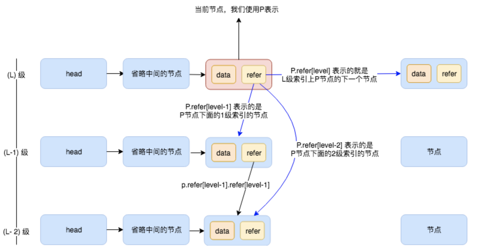
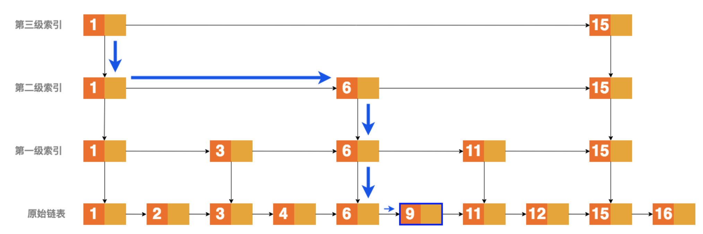
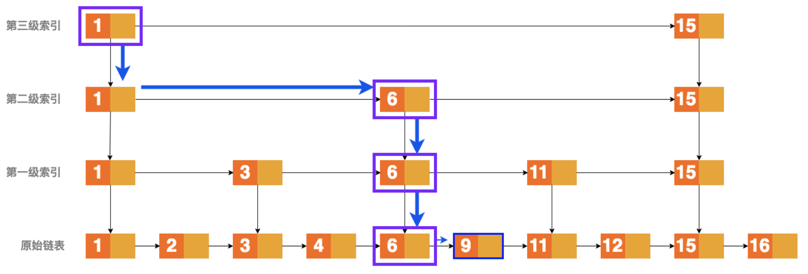
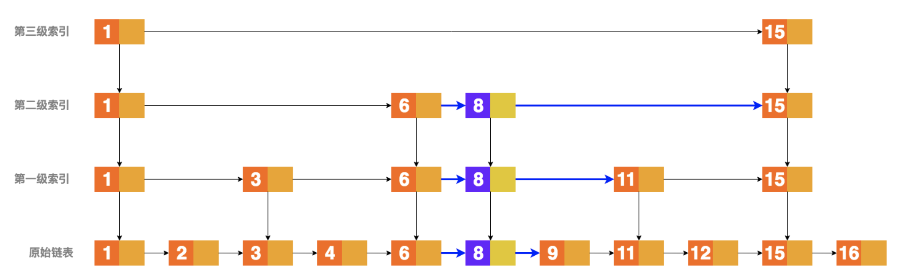
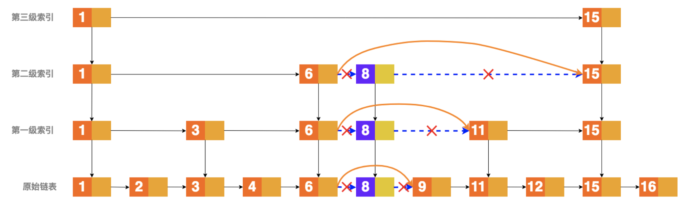

# Skip List

## 代码

注释如下

```javascript
// 定义了跳表索引的最大级数
const MAX_LEVEL = 16;

/**
 * 定义Node类，用来辅助实现跳表功能
 */
class Node {
  // data属性存放了每个节点的数据
  data = -1;
  // maxLevel属性表明了当前节点处于整个跳表索引的级数
  maxLevel = 0;
  // refer是一个有着MAX_LEVEL大小的数组，refer属性存放着很多个索引
  // 如果用p表示当前节点，用level表示这个节点处于整个跳表索引的级数；那么p[level]表示在level这一层级p节点的下一个节点
  // p[level-n]表示level级下面n级的节点
  refer = new Array(MAX_LEVEL);
}

/**
 * 定义SkipList类
 */
class SkipList {
  // levelCount属性表示了当前跳表索引的总共级数
  levelCount = 1;
  // head属性是一个Node类的实例，指向整个链表的开始
  head = new Node();

  // 在跳里面插入数据的时候，随机生成索引的级数
  static randomLevel() {
    let level = 1;
    for (let i = 1; i < MAX_LEVEL; i++) {
      if (Math.random() < 0.5) {
        level++;
      }
    }
    return level;
  }

  /**
   * 向跳表里面插入数据
   * @param value
   */
  insert(value) {
    const level = SkipList.randomLevel();
    const newNode = new Node();
    newNode.data = value;
    newNode.maxLevel = level;
    const update = new Array(level).fill(new Node());
    let p = this.head;
    for (let i = level - 1; i >= 0; i--) {
      while (p.refer[i] !== undefined && p.refer[i].data < value) {
        p = p.refer[i];
      }
      update[i] = p;
    }
    for (let i = 0; i < level; i++) {
      newNode.refer[i] = update[i].refer[i];
      update[i].refer[i] = newNode;
    }
    if (this.levelCount < level) {
      this.levelCount = level;
    }
  }

  /**
   * 查找跳表里面的某个数据节点，并返回
   * @param value
   * @returns {*}
   */
  find(value) {
    if (!value) {
      return null;
    }
    let p = this.head;
    for (let i = this.levelCount - 1; i >= 0; i--) {
      while (p.refer[i] !== undefined && p.refer[i].data < value) {
        p = p.refer[i];
        // 标记1，此处用于文章的说明
      }
    }

    if (p.refer[0] !== undefined && p.refer[0].data === value) {
      return p.refer[0];
    }
    return null;
  }

  /**
   * 移除跳表里面的某个数据节点
   * @param value
   * @returns {*}
   */
  remove(value) {
    let _node;
    let p = this.head;
    const update = new Array(new Node());
    for (let i = this.levelCount - 1; i >= 0; i--) {
      while (p.refer[i] !== undefined && p.refer[i].data < value) {
        p = p.refer[i];
      }
      update[i] = p;
    }

    if (p.refer[0] !== undefined && p.refer[0].data === value) {
      _node = p.refer[0];
      for (let i = 0; i <= this.levelCount - 1; i++) {
        if (
          update[i].refer[i] !== undefined &&
          update[i].refer[i].data === value
        ) {
          update[i].refer[i] = update[i].refer[i].refer[i];
        }
      }
      return _node;
    }
    return null;
  }

  // 打印跳表里面的所有数据
  printAll() {
    let p = this.head;
    while (p.refer[0] !== undefined) {
      // console.log(p.refer[0].data)
      p = p.refer[0];
    }
  }
}
```

## 说明

首先定义 `node` 辅助类,有三个属性，`data`, `maxLevel`, `refer`;`refer`是一个长度为`maxLevel`的数组，数组里面的值为指向其他节点的索引，如下图：



然后定义 SkipList 类，也就是要实现的跳表类；实例属性有 `levelCount` 、`head`。

`randomLevel` 方法用于生成不大于 `maxLevel` 的值，这个值可以在向 `SkipList` 插入元素时，生成随机的索引级数，**这个随机值是为了保证插入元素的时候，每一级索引节点的数量大概能为上一级索引节点的 2 倍**。

首先我们把整个链表的头指针赋值给 p（ `insert` 方法内说明为什么 `this.head` 就是整个链表的头指针），然后是两层循环，外层是一个 for 循环，里面是一个 while 循环；如下图：



`for` 循环是从 `SkipList` 的顶层索引开始循环，方向是从上到下的；`while` 循环则是从某一层的索引开始， 然后从左到右循环；当然，说的从上到下和从左到右，都是对照上面的那张图来进行说明的。

假设我们的 `SkipList` 是上面的那张图表示的那样，我们现在需要查找数值 9，应该怎么做？

首先从顶层开始遍历，看上面的图我们知道这个时候 `SkipList` 的 `levelCount` 应该是 `4`，因为是从 `0` 开始计算索引的级数(第 `0` 级索引也就是原始链表)，所以最顶层的索引的级数应该是 `levelCount - 1` 也就是 `3`，然后我们就进入了一个 `while` 循环，这个 `while` 循环的终止条件是：**当前节点在本层级的下一个节点(用 `p1` 表示)不为空(`undefined`)，并且 `p1` 的 `data` 值要小于要找的数值。**

我们用 `l` 表示当前索引的级数，用 `p` 表示当前遍历到的节点(或者可以理解为一个指针)，那么当 `l=3` 的时候，第一次 `while` 循环，`p.refer[3]`表示的是第三级索引的 `Node(1)`，因为满足 while 的循环条件，又进行一次操作，`p = p.refer[i]`，这表明我们此时遍历到了 `Node(1)`，或者说是当前的指针指向了 `Node(1)`;然后准备下一次循环，但是 `p.refer[i] !== undefined && p.refer[i].data < value` 这个表达式的值不为真，因为此时 `p` 表示的是 `Node(1)`，`p.refer[i]`表示的是 `Node(15)`，因为 `p.refer[i].data` 大于 `9`，所以内部的 `while` 循环终止。

此时外层的 for 循环让 i 变为了 2，然后 `p.refer[i]`表示的是第二级索引上面的 `Node(1)`，满足 `while` 循环，然后继续进行，一次类推，当 `p` 表示的是第 `0` 级索引的 `Node(6)`的时候，所有的循环都已经结束。

然后还需要进行一次判断，那就是当前位置的下一个节点是不是我们需要找的值(为什么还需要判断？因为我们循环的条件是当前节点的下一个节点的 `data` 值要小于我们查找的 `value`，如果循环结束，那说明当前节点的下一个节点的值大于或者等于 `value` 值，所以还需要进行以此判断)。如果是的话，就返回 `p.refer[i]`，如果不是就返回一个 `null`。

如下表格：

| 运行次数 | 当前 P 指向的节点 | 索引的级数 | 数据的层数 |  运行的循环  |
| :------: | :---------------: | :--------: | :--------: | :----------: |
|    0     |       head        |     3      |     4      |      -       |
|    1     |      node(1)      |     3      |     4      | [for, while] |
|    2     |      node(1)      |     2      |     3      | [for, while] |
|    3     |      node(6)      |     2      |     3      |   [while]    |
|    4     |      node(6)      |     1      |     2      | [for, while] |
|    5     |      node(6)      |     0      |     1      | [for, while] |

关于 insert 方法，在插入一个数据的时候，我们首先生成一个随机的 level 值，用来表示这个数据索引的级数； 然后我们生成一个新的节点 newNode，接下来我们创建一个 update 数组，这个数组的长度是 level； 里面存放的是一些节点。



接下来就是熟悉的两层循环，通过上面的那个表格我们可以看到，update 数组里面保存的就是 每次 `while` 循环终止的那个节点，就是上面图片 3 中紫色线框框起来的节点；然后我们又运行了一个 `for` 循环， 接下来的代码很有技巧，我们把新的节点的 `refer[i]`(`i`表示的是索引的级数)指向下一个节点，然后把 `update[i]`节点的 `refer[i]`指向新的节点 当循环完成的时候，我们就把这个数据插入到了原来的 `SkipList` 当中。更清晰直观的过程可以看下面的图片。



然后，还需要看一下当前的 `level` 是否大于 `SkipList` 的最大级数也就是 `levelCount`，如果大于当前的 `levelCount`， 还需要更新 `SkipList` 的 `levelCount`。

关于 `remove` 方法，我们首先需要找到要删除的元素； 如果这个元素在 `SkipList` 中不存在的话，我们不能够进行删除的操作； 只有这个元素在 `SkipList` 中存在的话，我们才能够进行删除操作； 所谓的删除也就是把 `P(pre)` 的索引指向 `P(next)` (其中 `P(pre)`表示位于同一级别索引的 `P` 节点的上一个节点，`P(next)`表示位于同一级别索引的 `P` 节点的下一个节点)， 这样我们就把这个节点删除掉了；下面的图形象地表示了这一个过程。



最后 printAll 方法，这个方法就是打印出在 `SkipList` 存储的所有数据；因为第 `0` 级索引存放的就是 我们的原始数据。
