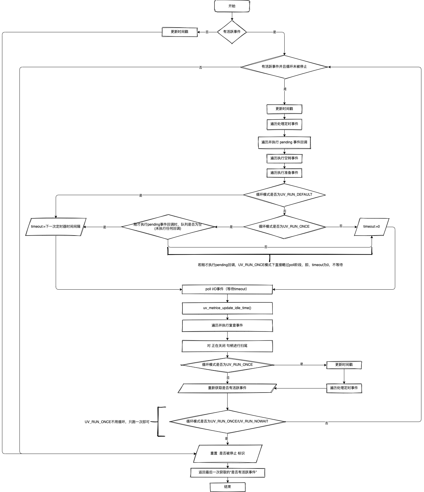

# 事件循环与异步 I/O

[MDN](https://developer.mozilla.org/zh-CN/docs/Web/JavaScript/EventLoop) 上面，有这么一段话：

- JavaScript 有一个基于事件循环的并发模型，事件循环负责执行代码、收集和处理事件以及执行队列中的子任务。这个模型与其它语言中的模型截然不同，比如 C 和 Java。

其实，JavaScript 的确是有一个基于事件循环的并发模型。但这以前是针对前端在 DOM 中进行操作的。V8 自己有实现一套事件循环，但 Node.js 中的事件循环则是自己实现的。

与浏览器不同，作为能跑后端服务的 JavaScript 运行时，必须要有处理系统事件的能力。比如去处理各种文件描述符对应的读写事件。一个最简单的事件循环的伪代码可如下：

```javascript
while (还有事件在监听) {
  const events = 从监听中获取所有事件信息;
  for (const event of events) {
    处理(event);
  }
}
```

一个 setTimeout 可以是一个 Timer 事件，一个文件读写是一个系统的 I/O 事件。对于浏览器来说，通常是没有后者的。而处理系统 I/O 事件，各系统平台早在多年前就有了成熟的方案了。如 Linux 的 epoll、macOS 的 kqueue、Windows 的 IOCP 等，这些统称为 I/O 多路复用。

Node.js 的事件循环基石就基于此。它基于 Ryan Dahl 自己开发的 libuv ，完成了自己的事件循环与异步 I/O。

# libuv

libuv 是一个聚焦异步 I/O 的跨平台库。它就是为 Node.js 而生的，后续才衍生出对其他项目的支持，如 Luvit、Julia、uvloop 等

它的 API 也很简单，无非包含文件描述符的监听、读写、连接，以及定时器……以及因为它是个“网络层”，自然要做各种网络请求，那么对于 DNS 的查询也是必要能力之一，所以 libuv 在最开始的版本中就加入了 c-ares 的依赖，这是一个用于异步 DNS 请求的 C 库。

# 事件循环 ≠ 异步 I/O

事件循环是一种并发模型，它的本质是一个死循环，在循环中不断处理到来的事件。异步 I/O 事件只是事件循环中事件的一种，除此之外，还有各种其他事件

事件循环就是个死循环，那么把它的逻辑按时序拉平，就是一条直线，或者公交路线。在死循环中，大部分时间都阻塞在等待事件，这个时候并不耗 CPU，而是等待底层 epoll 得到事件。

这个等待可以类比成公交车在路线上一直开，等到站。

而一旦有事件完成了（比如文件 I/O），epoll 就会得到通知，从而进入死循环代码块中的下一步，即拿着通知的相应内容去做用户业务逻辑。

比如文件读取完成了，那么 libuv 的事件循环会把对应信息给到等待这个事件的回调函数，通常这个回调函数最终会一路调用至 JavaScript，从而唤起 JavaScript 侧的文件读取的回调函数

```javascript
fs.readFile(filename, (err, content) => {
  fs.writeFile(filename, content, (err) => {
    // 假设这个 `writeFile` 写文件要持续 2 秒钟
  });

  setTimeout(() => {
    console.log("timer done!");
  }, 1000);
});
```

代码里面读取某个文件，然后就调用 libuv 去读取，假设没有更多其他事件，那么调用之后，epoll 就会等着读取完毕的事件，底层代码就阻塞在等待事件上，直到读取完成，有事件通知，才会最终调用。

这就相当于公交车一路行驶，然后看到到站了，就停下来，执行一波上下客操作，做完后继续上路.

解读：

1.  读取文件（fs.readFile）；

2.  事件循环阻塞直到第二站：收到读事件，触发回调。回调内做两件事：

    - 写一个文件（fs.writeFile）；
    - 设置一个定时器（setTimeout）；

3.  事件循环阻塞直到第三站：收到定时器事件，触发回调，回调内 console.log；

4.  事件循环阻塞直到第四站：收到写事件，触发回调，即里面注释的那行。

## 而 Node.js 究竟是单线程还是多线程

Node.js 究竟是单线程还是多线程的？其实不止是 Node.js，对于浏览器上的 JavaScript，大家都会有这样的疑问。

如果是单线程的话，异步 I/O 什么的怎么做？Watchdog （上帝视角，又称看门狗）怎么做。。。

引用知乎上一个[回答](https://www.zhihu.com/question/35905242?sort=created) ：

单线程是对你而言。对底层可不是，只不过其它线程对你不开放

node 源码[地址](https://github.com/nodejs/node/blob/main/src/api/embed_helpers.cc)：

```c
env->set_trace_sync_io(env->options()->trace_sync_io);
  {
    bool more;
    env->performance_state()->Mark(
        node::performance::NODE_PERFORMANCE_MILESTONE_LOOP_START);

    do {
      if (env->is_stopping()) break;
      uv_run(env->event_loop(), UV_RUN_DEFAULT);
      if (env->is_stopping()) break;

      platform->DrainTasks(isolate);

      more = uv_loop_alive(env->event_loop());
      if (more && !env->is_stopping()) continue;

      if (EmitProcessBeforeExit(env).IsNothing())
        break;

      {
        HandleScope handle_scope(isolate);
        if (env->RunSnapshotSerializeCallback().IsEmpty()) {
          break;
        }
      }

      // Emit `beforeExit` if the loop became alive either after emitting
      // event, or after running some callbacks.
      more = uv_loop_alive(env->event_loop());
    } while (more == true && !env->is_stopping());

    env->performance_state()->Mark(
        node::performance::NODE_PERFORMANCE_MILESTONE_LOOP_EXIT);
  }
```

uv_run(env->event_loop(), UV_RUN_DEFAULT) 就是跑一轮事件循环。

- [uv_run](https://github.com/nodejs/node/blob/main/deps/uv/src/unix/core.c)内容

uv_run() 中的 UV_RUN_DEFAULT 代表执行事件循环直到不再有活动的和被引用的句柄（handle）或请求（request）

说白一点，就是直到事件循环监听的池子里面里面已经没有关心的事件在等待了

上面这段代码有两层循环，第一层 uv_run() 里面实际的事件循环

然后在上面这段代码中肉眼可见的 do-while，实际上就是包在第一层循环外面的另一层循环

## do while

首先是无处不在的对 is_stopping() 的判断，一旦其处于待停止状态，就立马结束事件循环。

所以，可以先忽略

等一次 uv_run() 之后，去跑 V8 Platform 中的一些任务，跑完之后，并不清楚有没有新的事件放进去，所以得判断一下 uv_loop_alive() 现在是否还是为 0，若不为 0，则直接 continue 进入下一大波的事件循环；

如果真的为 0 了，那就是一些扫尾工作，比如看看有没有 process.on('beforeExit') 事件，若没有就可以直接退出事件循环了

若有，那就说明在这中间还有可能被丢入新的事件（比如 setTimeout() 等），那么在做一些事情（如执行 v8.startupSnapshot 的序列化回调）之后，再判断一下 uv_loop_alive() 里面是否有货，如果有，那么事件循环还得继续。进入下一轮循环。

do while 存在是为了保证 uv_run() 循环结束后，程序是真的要结束了，还是有可能会再丢事件进去，重新来一轮 uv_run()

## uv_run

分为 Win 平台和 Unix 平台，目前以 Unix 平台为例

```c
int uv_run(uv_loop_t* loop, uv_run_mode mode) {
  int timeout;
  int r;
  int can_sleep;

  r = uv__loop_alive(loop);
  if (!r)
    uv__update_time(loop);

  while (r != 0 && loop->stop_flag == 0) {
    uv__update_time(loop);
    uv__run_timers(loop);

    can_sleep =
        QUEUE_EMPTY(&loop->pending_queue) && QUEUE_EMPTY(&loop->idle_handles);

    uv__run_pending(loop); // pending 队列
    uv__run_idle(loop); // 空转队列
    uv__run_prepare(loop); // 准备队列

    timeout = 0;
    if ((mode == UV_RUN_ONCE && can_sleep) || mode == UV_RUN_DEFAULT)
      timeout = uv__backend_timeout(loop);

    uv__io_poll(loop, timeout);

    /* Process immediate callbacks (e.g. write_cb) a small fixed number of
     * times to avoid loop starvation.*/
    for (r = 0; r < 8 && !QUEUE_EMPTY(&loop->pending_queue); r++)
      uv__run_pending(loop);

    /* Run one final update on the provider_idle_time in case uv__io_poll
     * returned because the timeout expired, but no events were received. This
     * call will be ignored if the provider_entry_time was either never set (if
     * the timeout == 0) or was already updated b/c an event was received.
     */
    uv__metrics_update_idle_time(loop);

    uv__run_check(loop);
    uv__run_closing_handles(loop);

    if (mode == UV_RUN_ONCE) {
      /* UV_RUN_ONCE implies forward progress: at least one callback must have
       * been invoked when it returns. uv__io_poll() can return without doing
       * I/O (meaning: no callbacks) when its timeout expires - which means we
       * have pending timers that satisfy the forward progress constraint.
       *
       * UV_RUN_NOWAIT makes no guarantees about progress so it's omitted from
       * the check.
       */
      uv__update_time(loop);
      uv__run_timers(loop);
    }

    r = uv__loop_alive(loop);
    if (mode == UV_RUN_ONCE || mode == UV_RUN_NOWAIT)
      break;
  }

  /* The if statement lets gcc compile it to a conditional store. Avoids
   * dirtying a cache line.
   */
  if (loop->stop_flag != 0)
    loop->stop_flag = 0;

  return r;
}

```

首先判断有没有活跃的事件（监听 I/O、有定时器……），即 uv\_\_loop_alive()

```c
static int uv__loop_alive(const uv_loop_t* loop) {
  return uv__has_active_handles(loop) ||
         uv__has_active_reqs(loop) ||
         !QUEUE_EMPTY(&loop->pending_queue) ||
         loop->closing_handles != NULL;
}
```

由于后续的 while 语句是要判断有活跃事件的，所以逻辑相当于：若无活跃事件，则直接更新 loop 的最后处理时间；否则就进入 while 循环。

- 更新 loop 最后处理时间： uv\_\_update_time() 里面的逻辑就是更新 loop 结构体内部的时间戳字段：

```c
UV_UNUSED(static void uv__update_time(uv_loop_t* loop)) {
  /* Use a fast time source if available.  We only need millisecond precision.
   */
  loop->time = uv__hrtime(UV_CLOCK_FAST) / 1000000;
}
```

表示“最后一轮事件循环处理的时间是 uv\_\_hrtime(UV_CLOCK_FAST) / 1000000”，这个会在事件循环处理中用到这个字段。

如果我们进入了 while 循环，那逻辑就是开始处理事件了。里面依次逻辑为：

1.  更新 loop 最后处理时间；
2.  执行定时事件(在定时事件的小根堆（最小堆，经过排序的完全二叉树，可参考，base/dataStructure//heap）里遍历出相较于之前更新的“loop 最后处理时间” 已过期的事件，并依次执行其回调)
3.  遍历并执行 I/O 事件已结束（完成、失败）并丢进 pending 队列等待后续处理的事件对应的回调；
4.  遍历并执行空转（Idle）事件；
5.  遍历并执行准备（Prepare）事件；
6.  获取尚未触发的离现在最近的定时器的时间间隔（uv_backend_timeout），即事件循环到下一次循环的最长时间；
7.  根据 epoll、kqueue 等 I/O 多路复用机制，去监听等待 I/O 事件触发，并以上一步获取的时间间隔作为最大监听时间，若超时还未有事件触发，则直接取消此次等待，因为若时间到了还没有事件触发，而定时器触发时间到了，那 libuv 就要停下来去处理下一轮定时器了；
8.  执行一遍 uv\_\_metrics_update_idle_time()，更新 loop 中 Metrics 里的 idle_time，上一步中会更新其 provider_entry_time，然后更新 idle_time，但若上一步是直到超时还未有事件触发，则不会更新 idle_time，所以这里要做一次“最终更新”，若上一步已经更新了 idle_time，则这一步内部逻辑不会有任何效果，
9.  遍历并执行复查（Check）事件；
10. 遍历一遍一轮下来后变成“正在关闭”的句柄，并对其进行扫尾工作（如 TCP 类型就需要销毁其流）；
11. 若当前 uv_run 的模式为 UV_RUN_ONCE（即只跑一个 tick），则再次更新一遍 loop 最后处理时间并执行定时器事件，毕竟“现在”新的系统时间经过刚才一系列流程后又过了一会儿，这个时候就要把新时间内触发的定时器都搞完；
12. 重新判断一遍有没有活跃的事件，因为在上述一系列过程后，有可能一些监听被取消了；
13. 最后，若 uv_run 的模式为 UV_RUN_ONCE 或 UV_RUN_NOWAIT，则退出 while 循环，也就说，这两类模式都只跑一次循环。

流程图如下：


而正常情况下，while 循环的退出条件就是“没有活跃事件”了，且整个事件循环不处于 stop 状态（即 loop->stop_flag == 0）。

stop 状态由 uv_stop() 函数设置的，比如 WatchDog 看门狗中“杀死自己这条事件循环”，就是通过 uv_stop() 来停止其对应事件循环。最后，当 while 循环结束后，重置 stop 状态，以便下次外部再次开始事件循环。

uv_run 的最终返回值是最后一次获取的“是否有活跃事件”。通常情况下，都是没有活跃事件才会退出这个循环。

不过，若是其中途被终止（uv_stop()）或是模式为 UV_RUN_ONCE 等，还是会出现有活跃事件的，这个时候外部在用 libuv 的时候就要考虑是否要重新回到新的一轮 uv_run。

## 两个循环结合起来看

在 do while 中，执行了 uv_run() 进入循环，且模式是 UV_RUN_DEFAULT。不过 Node.js 中，并未使用其返回值，而是在 V8 Platform 跑了一遍任务之后，自己又通过 uv_loop_alive() 重新获取了一遍“是否有活跃事件”。在 Node.js 场景中，相比之下，堪堪执行完 uv_run() 之后的返回值并不具多大参考价值。

然后在 do while 中经历了一轮之后，可能活跃事件又充满了力量，所以我们重新来一轮 do while，在 while 中再进行新一轮 uv_run，如此循环往复。

# 各阶段介绍

上述流程图精简一下，就能得到 libuv 官网“设计概览”页面中的流程图

- [官网页面](http://docs.libuv.org/en/v1.x/design.html)

在 libuv 中，一次 uv_run 的执行顺序分别是：

1.  定时器
2.  Pending 态的 I/O 事件
3.  空转事件
4.  准备事件
5.  Poll I/O 事件
6.  复查事件
7.  扫尾

## 定时器

定义一个超时时间，到点触发。在每一轮 uv_run 中都是首先被执行的，其原理就是一个小根堆中维护所有定时器的时间与回调信息，每次都取最近一次，直到取到的定时器时间并未到点。所谓“到点”，就是基于每次通过 uv\_\_update_time() 把“当前时间”植入 loop 的时间点。

## Pending 态的 I/O 事件

在大多数情况下，所有的 I/O 回调函数都会在 Poll I/O 后立即调用。但是，还存在一些情况，需要将这样的回调函数推迟到下一次循环迭代中调用。如果上一次循环延迟了任何 I/O 回调函数，则会在此时调用它。

比如说，当 TCP 进行连接时，发生 ECONNREFUSED 错误时，就会需要延迟报错，将该错误的处理放入 pending_queue，等待下一轮 uv_run 循环时，在定时器处理之后再处理这个 Pending 态的 I/O 错误

```c
...
int uv__tcp_connect(uv_connect_t* req,
                    uv_tcp_t* handle,
                    const struct sockaddr* addr,
                    unsigned int addrlen,
                    uv_connect_cb cb) {
  int err;
  int r;

  assert(handle->type == UV_TCP);

  if (handle->connect_req != NULL)
    return UV_EALREADY;  /* FIXME(bnoordhuis) UV_EINVAL or maybe UV_EBUSY. */

  if (handle->delayed_error != 0)
    goto out;

  err = maybe_new_socket(handle,
                         addr->sa_family,
                         UV_HANDLE_READABLE | UV_HANDLE_WRITABLE);
  if (err)
    return err;

  do {
    errno = 0;
    r = connect(uv__stream_fd(handle), addr, addrlen);
  } while (r == -1 && errno == EINTR);

  /* We not only check the return value, but also check the errno != 0.
   * Because in rare cases connect() will return -1 but the errno
   * is 0 (for example, on Android 4.3, OnePlus phone A0001_12_150227)
   * and actually the tcp three-way handshake is completed.
   */
  if (r == -1 && errno != 0) {
    if (errno == EINPROGRESS)
      ; /* not an error */
    else if (errno == ECONNREFUSED
#if defined(__OpenBSD__)
      || errno == EINVAL
#endif
      )
    /* If we get ECONNREFUSED (Solaris) or EINVAL (OpenBSD) wait until the
     * next tick to report the error. Solaris and OpenBSD wants to report
     * immediately -- other unixes want to wait.
     */
      handle->delayed_error = UV__ERR(ECONNREFUSED);
    else
      return UV__ERR(errno);
  }

out:

  uv__req_init(handle->loop, req, UV_CONNECT);
  req->cb = cb;
  req->handle = (uv_stream_t*) handle;
  QUEUE_INIT(&req->queue);
  handle->connect_req = req;

  uv__io_start(handle->loop, &handle->io_watcher, POLLOUT);

  if (handle->delayed_error)
    uv__io_feed(handle->loop, &handle->io_watcher);

  return 0;
}
...

```

代码中的 uv\_\_io_feed 即将相关信息推入 pending_queue。

## 空转事件

空转事件会在每次 uv_run 循环中被执行。若事件循环中存在空转事件，uv_run 中会强行设置 timeout 为 0，即不阻塞 I/O 等待，可以马上开始进入下一轮轮回。具体实现就在获取 timeout 的函数 uv_backend_timeout() 中。

```c
static int uv__backend_timeout(const uv_loop_t* loop) {
  if (loop->stop_flag == 0 &&
      /* uv__loop_alive(loop) && */
      (uv__has_active_handles(loop) || uv__has_active_reqs(loop)) &&
      QUEUE_EMPTY(&loop->pending_queue) &&
      QUEUE_EMPTY(&loop->idle_handles) &&
      loop->closing_handles == NULL)
    return uv__next_timeout(loop);
  return 0;
}

int uv_backend_timeout(const uv_loop_t* loop) {
  if (QUEUE_EMPTY(&loop->watcher_queue))
    return uv__backend_timeout(loop);
  /* Need to call uv_run to update the backend fd state. */
  return 0;
}
```

QUEUE_EMPTY(&loop->idle_handles) 意思是说，若空转事件为空的情况下，则返回下一次计时器时间；若有空转事件，则直接返回 0。

Node.js 中，只有一个地方用到了空转事件，那就是 setImmediate()。为什么它能所谓的“immediate”？就是通过一个空的空转事件让 uv_run 强制不等待 I/O。

## 准备事件

准备事件与空转事件类似。它在一个 uv_run 中，晚于空转事件执行。与空转事件不同的是，它不阻塞 I/O，不会干涉 timeout。

## Poll I/O 事件

等到有事件触发的时候，再去执行相应的回调函数。

## 复查事件

它与“准备事件”一前一后，围绕着 Poll I/O 事件。可理解为一个是为 I/O 事件做准备，另一个是为其做一些后续额外操作。

## 扫尾

例如一个句柄被 uv_close() 所关闭，且其存在关闭的回调，则会在该阶段被调用。
